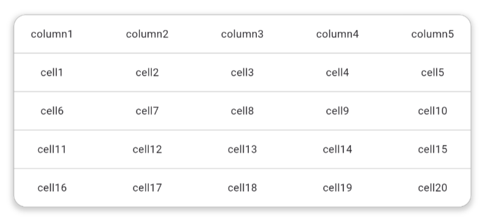

# FluidGrid

A lightweight, responsive, and customizable data grid for Flutter, built to deliver a seamless experience across web, desktop, tablet, and mobile.

> Designed for modern Flutter applications where responsiveness and developer experience matter.

---

## ✨ Features

- 📱 Responsive layouts for mobile, tablet, desktop, and web
- ⚡ Lightweight and optimized for performance
- 🎨 Fully customizable cell rendering
- 📊 Flexible column configuration
- 🔄 Smooth scrolling experience
- 🧩 Simple and intuitive API
- 🌐 Built with Flutter Web in mind

---

## 🚀 Installation

```yaml
dependencies:
  fluid_grid: ^0.0.4
```

Then run:

```bash
flutter pub get
```

---

## 📸 Preview



---

## 🛠 Quick Start

```dart
Scaffold(
  body: Padding(
  padding: const EdgeInsets.all(32.0),
  child: Column(
    mainAxisAlignment: MainAxisAlignment.start,
    crossAxisAlignment: CrossAxisAlignment.start,
      children: [
        FluidGrid(
          decoration: BoxDecoration(
          border: Border.all(color: Colors.grey, width: 0.5),
          borderRadius: BorderRadius.circular(16),
          boxShadow: [
              BoxShadow(
                color: Colors.grey.withOpacity(0.5),
                spreadRadius: 2,
                blurRadius: 5,
                offset: Offset(0, 3), // changes position of shadow
              ),
            ],
          ),
          headerHeight: 50,
          isBorderEnabled: true,
          columns: [
            FluidColumn(label: Text("column1"), width: 100),
            FluidColumn(label: Text("column2"), width: 100),
            FluidColumn(label: Text("column3"), width: 100),
            FluidColumn(label: Text("column4"), width: 100),
            FluidColumn(label: Text("column5"), width: 100),
          ],
          rows: [
            FluidRow(
              height: 50,
              cells: [
                FluidDataCell(child: Text("cell1")),
                FluidDataCell(child: Text("cell2")),
                FluidDataCell(child: Text("cell3")),
                FluidDataCell(child: Text("cell4")),
                FluidDataCell(child: Text("cell5")),
              ],
            ),
            FluidRow(
              height: 50,
              cells: [
                FluidDataCell(child: Text("cell6")),
                FluidDataCell(child: Text("cell7")),
                FluidDataCell(child: Text("cell8")),
                FluidDataCell(child: Text("cell9")),
                FluidDataCell(child: Text("cell10")),
              ],
            ),
            FluidRow(
              height: 50,
              cells: [
                FluidDataCell(child: Text("cell11")),
                FluidDataCell(child: Text("cell12")),
                FluidDataCell(child: Text("cell13")),
                FluidDataCell(child: Text("cell14")),
                FluidDataCell(child: Text("cell15")),
              ],
            ),
            FluidRow(
              height: 50,
              cells: [
                FluidDataCell(child: Text("cell16")),
                FluidDataCell(child: Text("cell17")),
                FluidDataCell(child: Text("cell18")),
                FluidDataCell(child: Text("cell19")),
                FluidDataCell(child: Text("cell20")),
              ],
            ),
          ],
        ),
      ],
    ),
  ),
)
```

---

## 🎯 Why FluidGrid?

FluidGrid is designed for developers who need a responsive data grid without the complexity of large enterprise solutions.

It focuses on:

- Clean API
- Responsive layouts
- Performance
- Flutter-first design
- Cross-platform consistency

---

## 📱 Responsive Behavior

FluidGrid automatically adapts to different screen sizes.

| Screen  | Behavior                      |
| ------- | ----------------------------- |
| Mobile  | Optimized for compact layouts |
| Tablet  | Adaptive columns              |
| Desktop | Full data grid experience     |
| Web     | Optimized for large screens   |

---

## 📄 License

MIT License © 2026 Mayur Madhwani